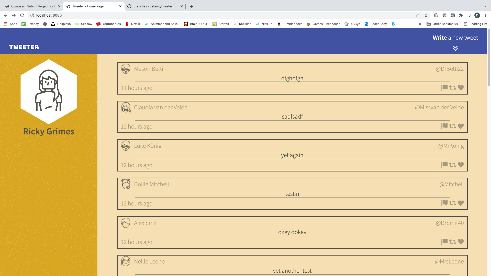
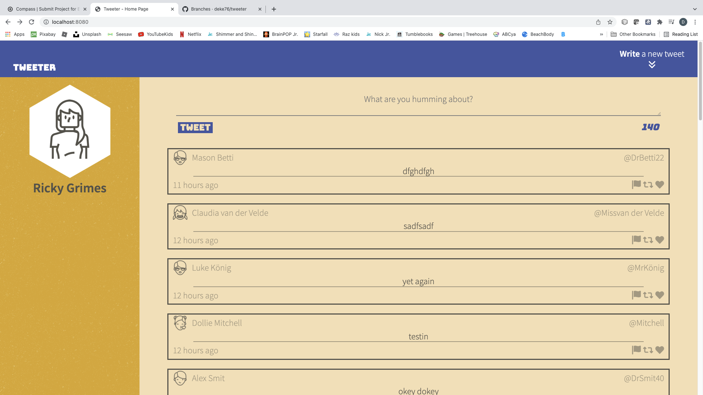
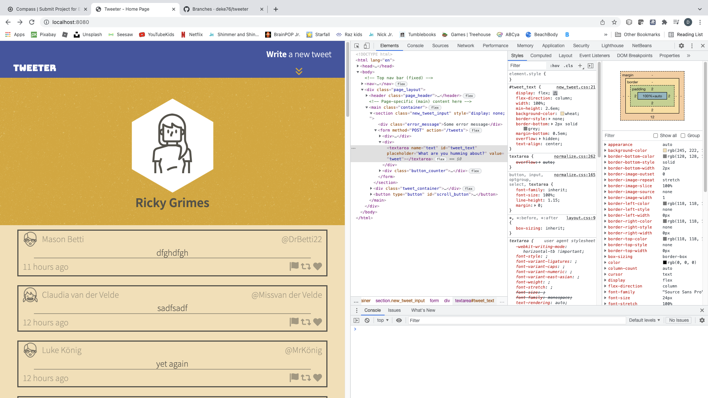

# Tweeter Project

Tweeter is a simple, single-page Twitter clone.

This repository is the finished code for the project: Students will fork and clone this repository, then build upon it to practice their HTML, CSS, JS, jQuery and AJAX front-end skills, and their Node, Express back-end skills.

## Dependencies

- Express
- Node 5.10.x or above
- Body-{arser
- Chance
- Nodemon

## Screenshots

## Run Instructions
start locally by ruunning npm start which will start an instance at port 8080, running npm run local will start the server with nodemon running to allow for local testing and server watching.
