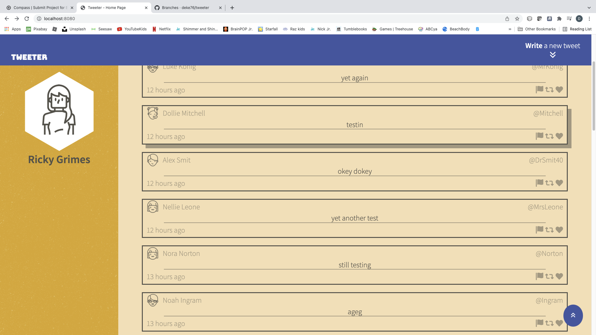

# Tweeter Project

Tweeter is a simple, single-page Twitter clone.

This repository is the finished code for the project: Students will fork and clone this repository, then build upon it to practice their HTML, CSS, JS, jQuery and AJAX front-end skills, and their Node, Express back-end skills.

## Dependencies

- Express
- Node 5.10.x or above

## Screenshots

